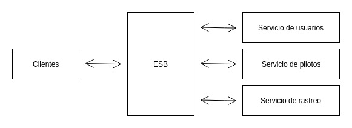
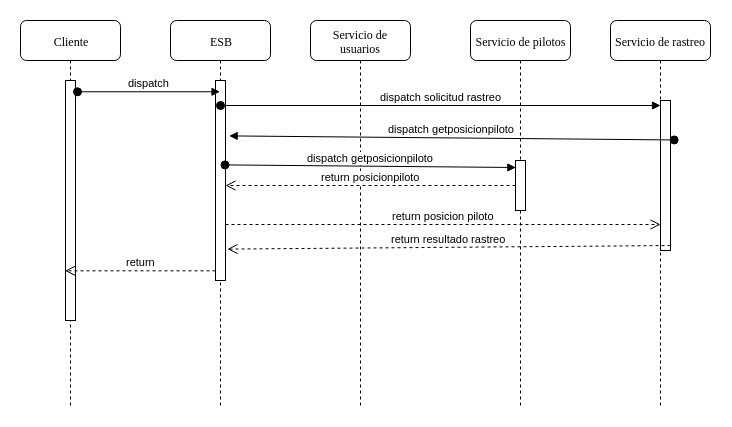

<h1 align="center">SOA: Service Choreography / Orchestration | ESB introduction</h1>
---

<p align="center"> 🤖 Tarea no. 2 Laboratorio Software Avanzado
    <br> 
</p>

## 📝 Tabla de contenido

- [Acerca de](#about)
- [Demo / Funcionamiento](#demo)
- [Como funciona](#working)
- [Uso](#usage)
- [Empezando](#getting_started)
- [Autor](#authors)

## 🧐 Acerca de <a name = "about"></a>

La aplicación simula el funcionamiento de Uber, donde pueden crearse usuarios y pilotos, así como tambien puede obtenerse la posicion de un piloto y solicitar un viaje, todo orquestado a traves de 3 servicios: 
* Servicio de usuarios
* Servicio de pilotos
* Servicio de rastreo

Estos servicios y el usuario final se comunican a travez de un ESB.

 Tanto los servicios como el ESB fueron realizados utilizando nodejs y el lenguaje javascript, implementando para cada uno una API REST independiente.

 **Estandarización**
 ---
 Para el codigo desarrollado se utilizó el JavaScript Standar Style

 Las reglas para este estandar pueden encontrarse en el siguiente enlace: https://standardjs.com/

## 🎥 Demo / Funcionamiento <a name = "demo"></a>

[](https://youtu.be/rGj4CRvRlwQ)

https://www.youtube.com/watch?v=rGj4CRvRlwQ&feature=youtu.be


## 💭 Como funciona <a name = "working"></a>
Para la comunicación entre servicios debe hacerse exclusivamente a traves del ESB.

La arquitectura de interacción de los servicios se muestra en la siguiente gráfica: 



Para hacer una solicitud de rastreo se hace al ESB el cual hace la solicitud al servicio de rastreo, este servicio utiliza al mismo ESB para comunicarse con el servicio de piloto para obtener la posicion y luego se devuelve al cliente la informacion. 
Esta interacción se puede apreciar de mejor manera en el siguiente diagrama: 



Para hacer la solicitud del inicio de un viaje el cliente se comunica con el esb, luego este envia la peticion de asignacion de piloto al servicio de pilotos. Al recibir la respuesta del servicio de pilotos el esb tambien envia la información al servicio de usuarios para que registre la información. Luego la confirmación es devuelta al cliente.

Para la finalización del viaje el proceso es el mismo que para la solicitud solo cambia la accion que se hace en cada servicio que seria la de liberar al piloto.

## 🎈 Uso <a name = "usage"></a>

Para utilizar el servicio puede ir a la carpeta de cada uno, donde estan definidas todas las funciones de cada API REST.


---

## 🏁 Empezando <a name = "getting_started"></a>

Estas instrucciones le proporcionarán una copia del proyecto en funcionamiento en su máquina local para fines de desarrollo y prueba.

### Prerequisitos

Necesita tener nodejs instalado en sus sistema operativo, si utiliza una distribución linux basada en debian como Ubuntu puede obtenerlo con el comando: 

```
sudo apt-get install nodejs
```
Tambien es necesario contar con el administrador de paquetes para node npm, se puede instalar con el comando:_ 

```
sudo apt-get install npm
```

### Instalacion

 Luego de descargar el repositorio es necesario descargar las dependencias de cada servicios, para ello hay que ir a cada una de las carpetas y ejecutar el comando: 

```
npm install
```
## ✍️ Autor <a name = "authors"></a>

- [@kevinmoran100](https://github.com/kevinmoran100) 
